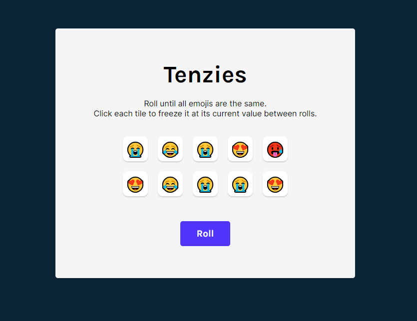

# Tenzies Game

Tenzies is a simple game built using Vite and React where the objective is to match all the emojis.

## Play now

[PLAY NOW: Tenzies Game](https://jhean-tenzies.netlify.app/")

## How to Play

1. **Setup**: Open the game in your browser. You'll see a set of tiles, each displaying an emoji.

2. **Roll the Dice**: Click the "Roll" button to roll the dice. Each tile will change to a random emoji.

3. **Freeze Tiles**: If you're satisfied with the outcome of a specific tile, click on that tile to freeze it. The tile will retain its current value in subsequent rolls.

4. **Continue Rolling**: You can continue rolling the dice until all tiles display the same emoji.

5. **Winning**: The game is won when all tiles have the same emoji. You'll be notified of your success.

## Technologies Used

- Vite: A fast build tool for modern web development.
- React: A JavaScript library for building user interfaces.
- Other libraries or dependencies used can be found in the `package.json` file.

## Contribution

This project was created as a practice exercise in learning React. Contributions are welcome! If you find any issues or want to improve the game, feel free to create a pull request or open an issue.

## Credits

- Emojis provided by [EmojiOne](https://emojione.com/).